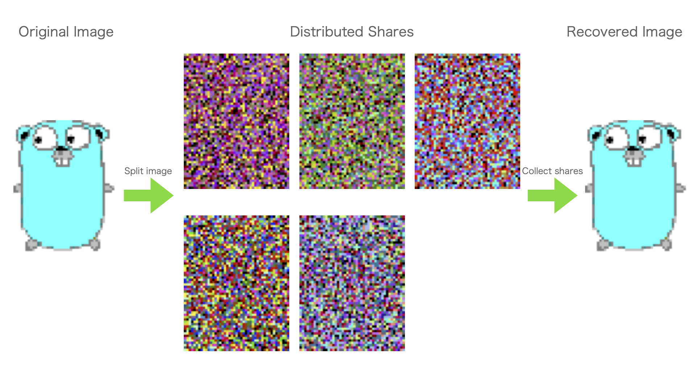
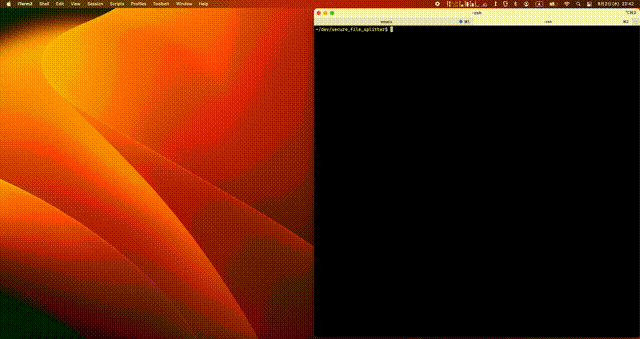

# About this

Secure File Splitter is an application that allows you to secure your secret file by distributing them.

# Detail

Secure File Splitter distributes a file(picture) over ***n*** **shares** based on Samir's secret sharing.
The individual shares themselves have no special meaning, and original image can be restored only when it has attracted more than a predetermined **threshold** ***(= k)*** number of shares.

# How to run

- Run Image test : ./test.sh or python3 main.py 5 5 main

- Run WebCamera test : ./camera_test.sh or python3 main.py 5 5 camera

- Run WebCamera with fail test : ./camera_fail.sh or python3 main.py 1 2 camera_compare

Secure File Splitter includes cv2 and PIL as external libraries.
Therefore, please install those libraries when you test this.

- Demo

BMP, JPEG, GIF test\

with my Mac(2020 m1, 16GB) it takes 0.05sec to recover JPEG image\
Generate Shares -> 42.04 MB/sec

Recover Images -> 32.71 MB/sec

WebCamera test (n = 5, k = 5)\

WebCamera test (n = 50, k = 50)\

Web Camera with Fail test (n = 1, k = 2)\
This demo is low performance because of using BMP format.\
The left side shows that recover fail because threadshold k(=2) is bigger than number of shares n(=1).\
The right side shows that all shares collected.

If you have Web Camera, you can check the recovered video data acquired from the Web Camera with almost no delay!

You can change first argument(number of shares *(=n)*) and second argument(threashold *(=k)*) at will (need *n >= k*),
but be careful not to use too large values,
as this Application will drastically reduce the frame rate.

I recommend the default value or at most 20