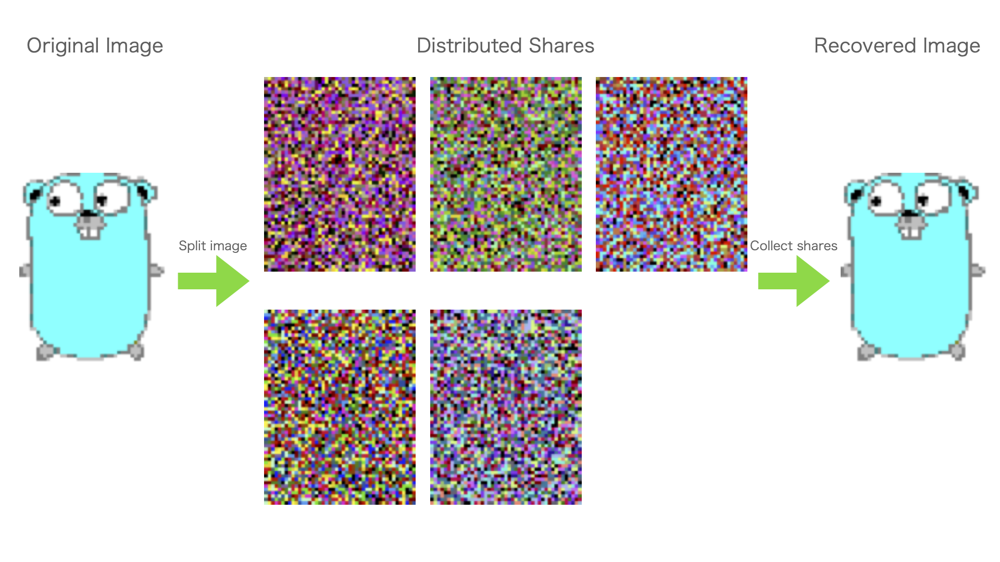
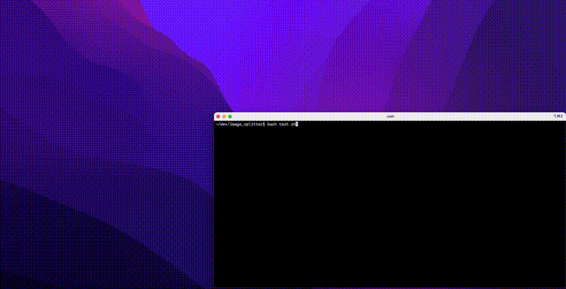

# About this

image splitter is an application that allows you to secure your secret images by distributing them.

# Detail

image splitter distributes an image into several "shares" based on Samir's secret sharing.
The individual shares themselves have no special meaning, and original image can be restored only when it has attracted more than a predetermined "threshold" number of shares.

# How to run

- Run : ./test.sh or python3 main.py

image splitter includes cv2 as external libraries.
Therefore, please install those libraries when you test this.

- Demo

BMP format test\

JPEG format test\

with my Mac(2020 m1, 16GB) it takes 0.05sec to recover JPEG image\
Generate Shares -> 42.04 MB/sec

Recover Images -> 32.71 MB/sec

# TODO:
- Improve efficiency of Encode, Decode
